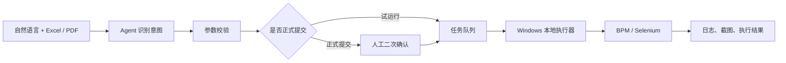

<picture>
  <source media="(prefers-color-scheme: dark)" srcset="https://raw.githubusercontent.com/yuyuezhou0806/yuyuezhou0806/main/banner.svg">
  <source media="(prefers-color-scheme: light)" srcset="https://raw.githubusercontent.com/yuyuezhou0806/yuyuezhou0806/main/banner-light.svg">
  
</picture>

## 把工程业务，做成真正能运行的软件

我关注的不是让 AI 多说几句话，而是让它理解业务、调用工具、经过确认，并把结果可靠地落到真实工作流程里。

目前主要在做：

- 工程检测领域的 AI Agent 与知识系统
- Excel、PDF、OCR 和浏览器业务自动化
- Python / FastAPI / Next.js 全栈产品
- 可审计、可确认、可回退的人机协作流程

<p>
  <a href="http://1.15.170.85/agent/"></a>
  <a href="https://github.com/yuyuezhou0806/idi-defects"></a>
</p>

---

## 01 / 当前主项目

### 检测行业智能 Agent

一个面向工程检测业务的多 Agent 系统。它不仅回答问题，也能连接结构化项目数据、专业知识库和本地自动化执行器。

| 系统能力 | 实现 |
|---|---|
| 专业问答 | 工程规范、检测周期、单价、缺陷风险检索 |
| 多 Agent | 报价、知识、通用业务三个专业 Agent 路由 |
| 业务工具 | 项目查询、图片分析、报告判读、合同生成等 11 个工具 |
| 自动化 | 自然语言创建工期延期和工作量汇报任务 |
| 安全控制 | 正式提交二次确认、用户认证、审计日志、失败记录 |
| 运行架构 | Linux 服务端派发任务，Windows 执行器运行 Selenium |



[在线体验](http://1.15.170.85/agent/) · [查看项目源码](https://github.com/yuyuezhou0806/-/tree/main/inspection_agent)

---

## 02 / 用数字说明

| `599` | `3` | `11` | `2` |
|:---:|:---:|:---:|:---:|
| 结构化工程缺陷记录 | 专业 Agent | Agent 业务工具 | 已接入 BPM 自动化流程 |

这些数字不是演示用占位符，而是当前系统已经连接的业务能力。

---

## 03 / 代表作品

### Inspection Agent

面向工程检测业务的多 Agent 系统，把专业知识检索、结构化项目数据、文档生成和 Windows 自动化串成完整工作流。

`FLAGSHIP` `ONLINE` `MAINTAINED 2026.06` `LangGraph` `FastAPI` `Next.js`

[在线体验](http://1.15.170.85/agent/) · [查看源码](https://github.com/yuyuezhou0806/-/tree/main/inspection_agent)

### IDI Defects

将 599 条工程质量险缺陷记录整理为可检索的质量风险知识系统，用于缺陷查询、分类浏览和检测风险参考。

`ONLINE` `MAINTAINED 2026.06` `Python` `FastAPI` `Structured Data`

[在线使用](http://1.15.170.85/idi/) · [查看公开数据仓库](https://github.com/yuyuezhou0806/idi-defects)

### Contract Automation Suite

从截图和文档中识别项目字段，完成合同信息提取、模板填充和批量文档生成。

`PROTOTYPE` `OCR` `Python` `Document Automation`

[查看历史源码](https://github.com/yuyuezhou0806/-/tree/main/contract_flow)

### Settlement Forms

把 Excel 中的结算数据批量写入标准 Word 模板，减少重复录入与格式错误。

`ONLINE` `MAINTAINED 2026.06` `Excel` `Word` `Batch Processing`

[在线使用](http://1.15.170.85/settlement/) · [查看源码](https://github.com/yuyuezhou0806/-/tree/main/settlement_forms)

---

## 04 / 我的技术取向

```text
让模型负责理解意图
让代码负责确定性执行
让人保留最终决定权
让系统记录完整过程
```

我尤其在意 AI 推理与传统软件工程之间的边界：模型可以灵活，但业务动作必须明确、可验证、可追踪。

**主要工具**

`Python` · `FastAPI` · `LangGraph` · `RAG` · `Chroma` · `Selenium`

`TypeScript` · `Next.js` · `React` · `Vue` · `SQLite` · `Docker`

`Excel / Word / PDF Automation` · `OCR` · `Unity / C#`

---

## 05 / Activity

<p align="center">
  
  
</p>

<p align="center">
  
</p>

---

<p align="center">
  <sub>Shanghai · AI agents · Engineering automation · Building useful systems</sub>
</p>
